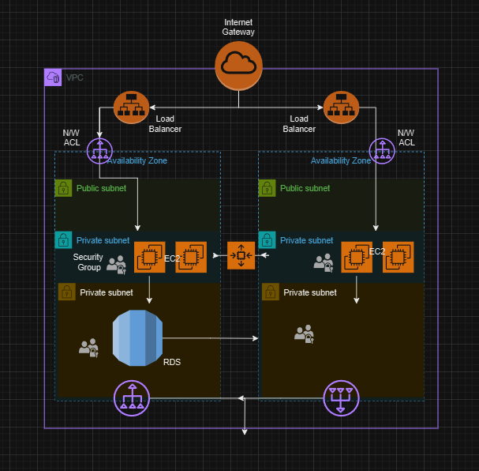

# Three-Tier Web Application Architecture on AWS

## Project Overview

This project presents a robust, scalable, and secure three-tier web application architecture using Amazon Web Services (AWS). The architecture is designed to handle web requests from the internet, process them through an application layer, and interact with a MySQL database backend.

## Architecture Diagram

This diagram illustrates the key components of our three-tier architecture within AWS.

## Architecture Components

1. **Amazon Virtual Private Cloud (VPC)**
   - Provides network isolation and security
   - Spans across two Availability Zones for high availability

2. **Internet Gateway**
   - Enables communication between the VPC and the internet

3. **Elastic Load Balancer (ELB)**
   - Distributes incoming application traffic across multiple EC2 instances
   - Placed in public subnets for internet-facing access

4. **Amazon Elastic Compute Cloud (EC2)**
   - Hosts the web application servers
   - Placed in private subnets for enhanced security
   - Utilizes Auto Scaling for automatic adjustment of capacity

5. **Amazon Relational Database Service (RDS) for MySQL**
   - Hosts the MySQL database
   - Configured for high availability with Multi-AZ deployment
   - Placed in private subnets for enhanced security

6. **Security Groups and Network ACLs**
   - Provide network-level security for EC2 instances and RDS

## Network Design

- **Public Subnets**: Host the load balancers
- **Private Application Subnets**: Host the EC2 instances running the web application
- **Private Database Subnets**: Host the RDS MySQL instances

## High Availability and Fault Tolerance

- Architecture spans two Availability Zones
- Auto Scaling ensures application layer resilience
- RDS Multi-AZ configuration provides database fault tolerance

## Security Measures

- EC2 instances and RDS are placed in private subnets
- Security groups control inbound and outbound traffic at the instance level
- Network ACLs provide subnet-level security

## Traffic Flow

1. Client requests come through the Internet Gateway
2. Requests are distributed by the ELB to EC2 instances
3. EC2 instances process requests and interact with RDS as needed
4. Responses follow the reverse path back to the client

## Scalability

- Auto Scaling adjusts the number of EC2 instances based on demand
- RDS can be scaled vertically (instance size) or horizontally (read replicas)

## Monitoring and Management

- Amazon CloudWatch can be used for monitoring and alarms
- AWS Identity and Access Management (IAM) for access control

## Next Steps

- Implement the architecture using AWS CloudFormation or Terraform
- Set up CI/CD pipelines for application deployment
- Configure detailed monitoring and logging
- Implement backup and disaster recovery strategies

## Contributing

Please read CONTRIBUTING.md for details on our code of conduct and the process for submitting pull requests.

## License

This project is licensed under the MIT License - see the LICENSE.md file for details.

## Author

This project was created by Manish Kumar Tailor. For more projects and information, visit my portfolio at [Portfolio](https://manish-kt.github.io/portfolio-website/).
